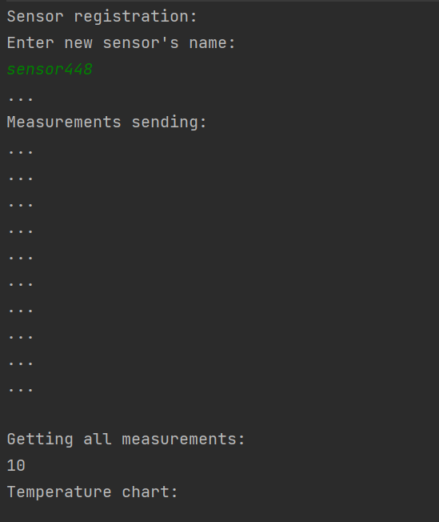
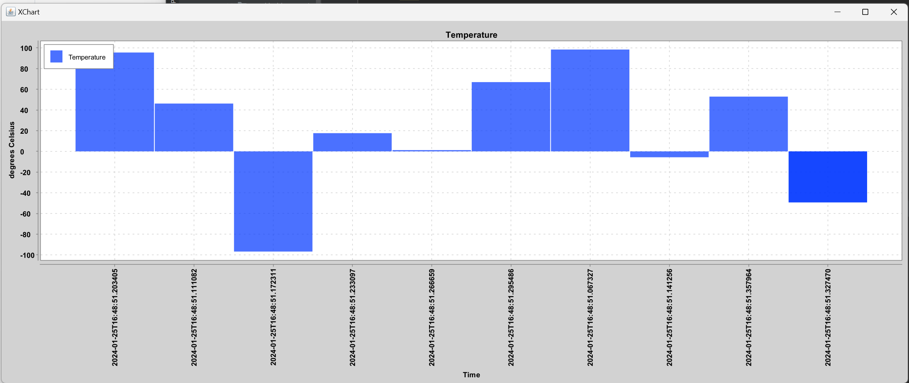

# Measurements
#
## This REST API organises data acquisition from a meteorological sensor and storing it in a database with the possibility of further analysis: displaying a temperature graph, counting rainy days.
#
## The sensor measures the ambient air temperature and can determine whether it is raining or not, it also has access to the Internet, so it can send HTTP requests to our server.
#
## The project is divided into 2 parts:
## 1. REST API using Spring REST
## 2. SensorImitator which sends random data.
#
## The application sends and receives JSON data.
#
## Since there is no real sensor, SensorImitator acts as a sensor.
#
## The SensorImitator sends 10 requests with random temperatures and "rain" statuses to the REST API Measurements. After that, a temperature chart is generated using the data received from the server.
### Console:

#
### Chart:

#
#
*** Sensor names must not be repeated, the sensor name must not be blank or contain less than 3 or more than 30 characters.
All fields of a measurement are validated:
- The temperature value should not be empty and should be in the range from -100 to 100.
- The "raining" value should not be empty.
- The "sensor" value should not be empty. Additionally, a sensor with this name must be registered in the system.
 ***
____
*Java 17.0.0.1
____
   
     
